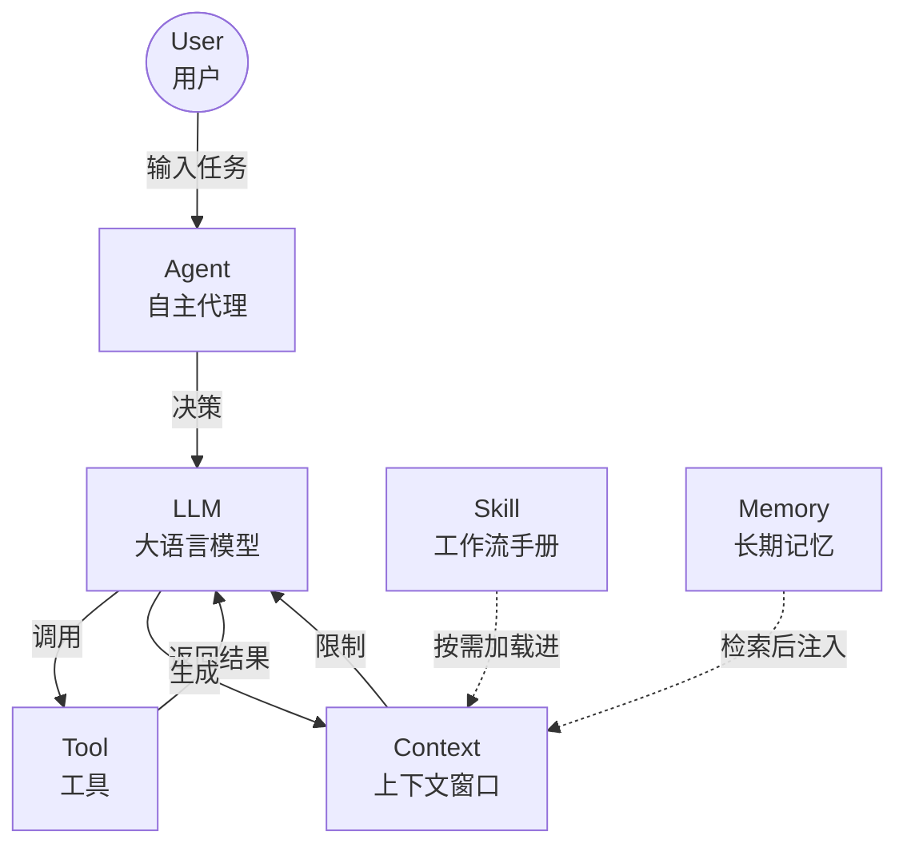
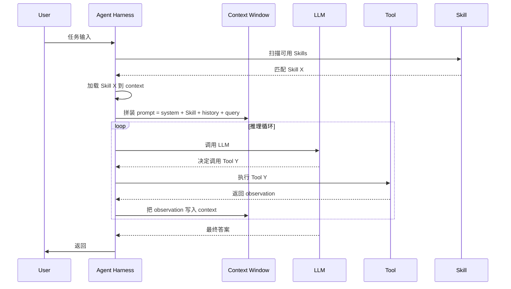
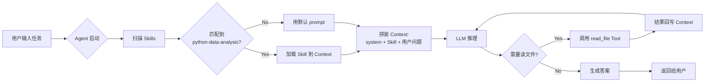
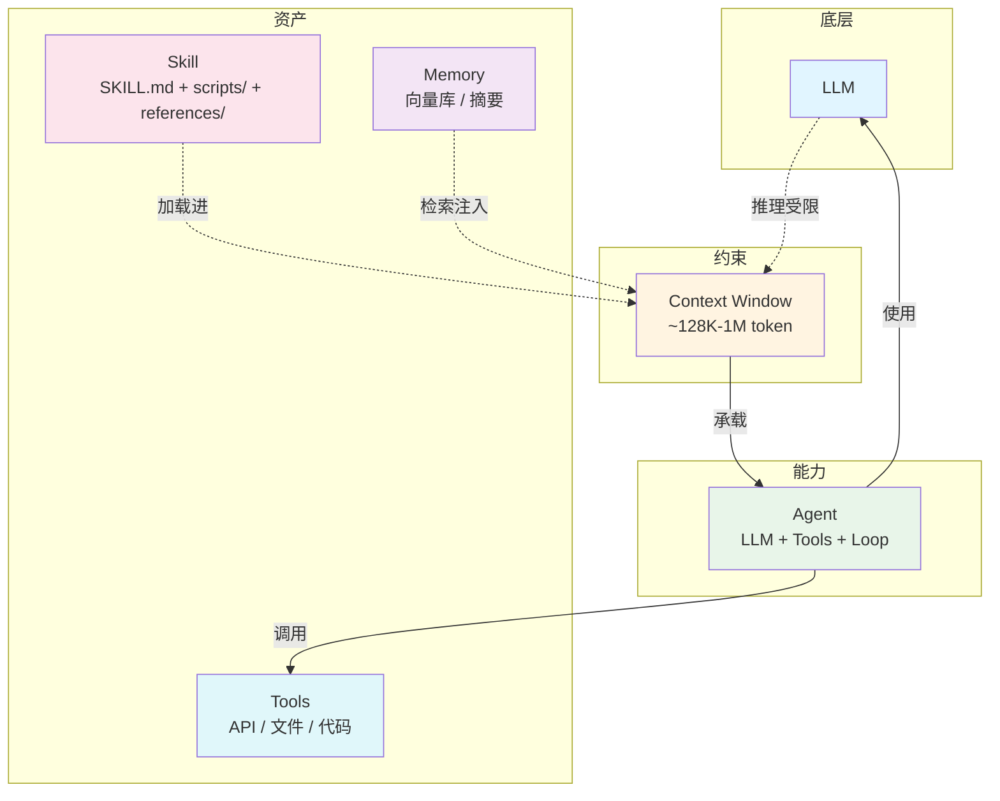

# 概念关系：Agent / 上下文 / Skill

> 三者不是并列概念，而是 **"能力 → 约束 → 资产"** 的三层关系。
> 本文用文字 + Mermaid 图 + 表格说明，重点回答两个问题：
> 1. **上下文如何影响 Agent 的工作**？
> 2. **Skill 如何沉淀可复用的任务知识**？

---

## 1. 一句话定义

| 概念 | 一句话 |
|------|--------|
| **LLM** | 底层模型，能基于上文预测下一个 token |
| **上下文（Context）** | LLM 一次推理能"看见"的最大 token 预算 |
| **Agent** | 用 LLM 当大脑 + 工具 + 控制循环，能自主推进任务的程序 |
| **Skill** | 标准化的工作流文档（SKILL.md + 资源），让 LLM 在特定任务上更专业 |

---

## 2. 三个概念的层级关系

```
LLM（底层能力）
  ↓ 提供 reasoning
Agent（自主执行的程序）
  ↓ 使用
Context（每次推理的工作面）
  ↓ 承载
Skill（标准化的操作手册）
```

> **核心关系**：LLM 是 Agent 的大脑；Context 是大脑每次思考的"桌面"；Skill 是放在桌面上的"操作手册"。

---

## 3. 关系图（Mermaid）

### 3.1 总体关系



### 3.2 单次推理的信息流



> **关键观察**：Context 是**唯一一个**所有信息都会经过的"瓶颈"。Tool 结果、Skill 内容、历史对话、用户问题 —— 全部要挤进同一个窗口。

---

## 4. 重点 1：上下文如何影响 Agent 的工作

### 4.1 影响机制

Agent 的每一次推理 = **把所有可用的信息塞进 Context，再让 LLM 看**。所以 Context 直接决定了 Agent 的"工作面大小"。

| Context 状态 | Agent 表现 |
|-------------|-----------|
| 充足 | 能"看到"所有历史、工具结果、Skill 指令 → 决策连贯 |
| 接近上限 | 中间段信息开始"模糊"（Lost-in-the-Middle）→ 决策变差 |
| 超出 | 最早的内容被**静默截断** → Agent 突然"失忆" |
| 完全错配 | 关键信息被工具结果挤出去 → Agent 偏离目标 |

### 4.2 三种具体影响

**① 影响"能不能记得历史"**
- 客服 Agent 聊到第 20 轮，关键事实被截断 → 答非所问
- 解决：升级窗口 / 加摘要 / 关键事实前置到 system prompt

**② 影响"能不能用工具"**
- 工具调用的结果会消耗 token
- 如果一次返回 50K token（如大文件读取），剩下的"决策空间"所剩无几
- 解决：分块读 / 流式读 / 只把"摘要"喂回

**③ 影响"能不能用 Skill"**
- Skill 内容也是 context 的一部分
- 如果 Skill 写得过长（5K+ token），实际可用窗口被严重压缩
- 解决：Skill 保持精简，详细信息放 references/ 按需加载

### 4.3 关系表

| Context 现象 | 对 Agent 的具体影响 | 缓解技术 |
|------------|-------------------|----------|
| 窗口满 | 失忆 | 摘要 / 升级窗口 |
| 中间段模糊 | 决策漂移 | 把关键信息放首尾 |
| 工具结果太大 | 决策空间被挤占 | 分块 / 流式 / 摘要后回写 |
| Skill 过长 | 实际可用窗口缩小 | Skill 精简 + 拆 references |
| 无关信息多 | 分心 | 优先级排序 |

---

## 5. 重点 2：Skill 如何沉淀可复用的任务知识

### 5.1 沉淀路径

```
个人 prompt（一次性）
   ↓ 反复用得顺
私人模板（自己用）
   ↓ 团队成员也开始用
团队 Skill（git 仓库共享）
   ↓ 跨产品复用
组织级 Skill（admin 统一管理）
```

> **Skill 解决的核心问题**：把"某人会做某事"变成"任何 LLM 都能按这套流程做某事"。

### 5.2 沉淀的三种方式

**① 显式沉淀**：把"反复用得顺的 prompt" 改写成 SKILL.md
- 入口：一个稳定可复用的工作流
- 动作：写成 YAML frontmatter + 步骤 + 模板
- 验证：在 3 个不同任务上跑通

**② 隐式沉淀**：让 `skill-creator` 自动生成 [1]
- 入口：你描述一遍工作流
- 动作：Claude 帮你生成 SKILL.md 和目录结构
- 验证：再跑一次，看是否一致

**③ 演化沉淀**：先有 prompt → 总结规律 → 改写成 Skill → 在实践中再修订
- 入口：发现"我每次都这么写"
- 动作：找出模式、抽象成步骤、写到 SKILL.md
- 验证：换个人 / 换个任务能否成功

### 5.3 Skill 的复用层次

| 层次 | 范围 | 谁来维护 | 例子 |
|------|------|----------|------|
| L1 个人 | 单人 | 自己 | 自己的代码风格 Skill |
| L2 团队 | 团队 | 团队 lead | 团队代码审查 Skill |
| L3 组织 | 全公司 | admin | 财务、HR、合规 Skill |
| L4 生态 | 跨组织 | 社区 | Notion / Canva / Atlassian 合作伙伴的 Skill [1] |

> **趋势**：Anthropic 在 2025-12 推出了"组织级 Skills 目录"，开始标准化 L3–L4 共享 [2]。

### 5.4 Skill 与 Prompt 的本质区别

| 维度 | Prompt | Skill |
|------|--------|-------|
| 触发 | 用户每次手动 | LLM 根据 description 自动判断 |
| 结构 | 字符串 | 目录（SKILL.md + 资源） |
| 持久 | 不（除非手动存） | 持久（git 仓库） |
| 协作 | 个人 | 团队 / 组织 / 生态 |
| 演化 | 改一次重新输入 | 改一次所有人下次自动用 |

> **Skill = 结构化 + 持久化 + 可协作化 的 prompt**。一旦一个工作流稳定下来，就应该沉淀成 Skill。

---

## 6. 三者协同：完整工作流示例

> 场景：用户说"用 Python 写一个函数，输入是 CSV 路径，输出是每列缺失率"



**这个例子里**：
- **Context** 是"装下所有信息的容器"（system prompt + Skill + 工具结果 + 问题）
- **Agent** 是"用 LLM + 工具 + 循环的程序"（决定调不调 read_file、什么时候停）
- **Skill** 是"标准化的操作手册"（告诉 LLM 写 Python 函数的标准格式、错误处理方式）

> **如果 Skill 不存在**：LLM 会按默认风格写，可能不规范。
> **如果 Context 不够大**：读大文件后，Skill 内容可能被挤出去，LLM 又退回默认风格。
> **如果 Agent 没有控制循环**：LLM 一次性答完就走，不读文件、不查错。

三者缺一不可。

---

## 7. 易混淆点速查

| 易混淆 | 正确区分 |
|--------|----------|
| "Skill 就是预设的 prompt 模板" | ❌ Skill 是**目录**，有 frontmatter + 资源，可被 LLM 自动加载；prompt 是**字符串** |
| "Context 越大 Agent 越聪明" | ❌ 反而容易"分心"（Lost-in-the-Middle） |
| "Agent = LLM + 工具" | ❌ 还差**控制循环**（少了循环就退化成"调用一次工具的一次性脚本"） |
| "Skill 越多越好" | ❌ 每个 Skill 都会占 context 预算，过多反而拖慢 |
| "Tool 和 Skill 是同一种东西" | ❌ Tool 是 LLM 能调用的**功能**（手），Skill 是 LLM 的**操作手册**（说明书） |

---

## 8. 一张图总结



---

## 9. 参考来源

| # | 来源 | URL | 检索日期 |
|---|------|-----|----------|
| [1] | Anthropic, "Introducing Agent Skills" | https://www.anthropic.com/research/skills | 2026-09-10 |
| [2] | Claude Blog, "Skills for organizations, partners, the ecosystem" | https://claude.com/blog/organization-skills-and-directory | 2026-09-10 |

> 关于 Agent / Context 的更多细节，分别见同目录下的：
> - `agent.md`（Agent 三零件、Workflow vs Agent、真假 Agent 判断）
> - `llm-context.md`（5 种优化技术、Token 估算、Lost-in-the-Middle）
> - `skill.md`（四大特征、目录结构、Skill vs Prompt）

---

## 修订记录

| 日期 | 修订人 | 修订内容 |
|------|--------|----------|
| 2026-09-10 | 小豆（AI 起草） | 初版。Mermaid 图 + 关系表 + 协同示例。"沉淀路径"段与"复用层次"段为 AI 综合多份资料得出的归纳，未在单一来源中显式出现，标注为 AI 起草、需用户核验 |
| _（待补）_ | _（用户）_ | _（待用户核读后追加）_ |
